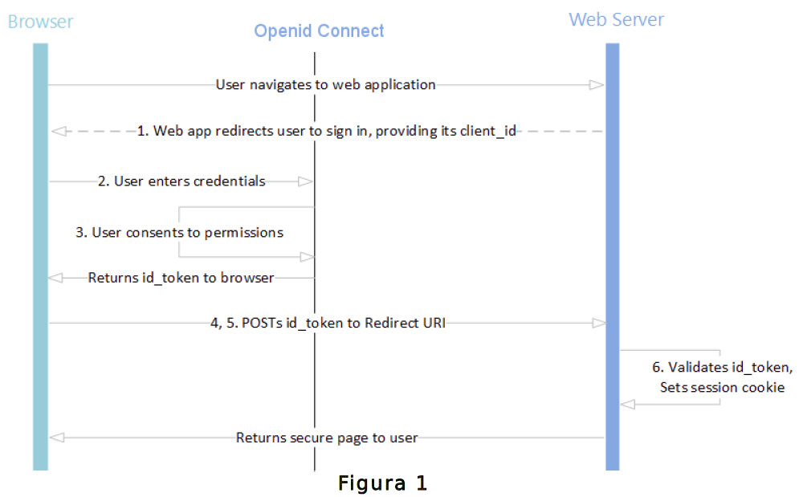

Arquitetura de Serviço e Protocolos
===================================

*Openid Connect (OIDC)*
++++++++++++++++++++++

O *Openid Connect* é um protocolo baseado no *OAuth 2.0* que especifica autorização e autenticação. Define como implementar o gerenciamento de autorizações de acesso, gerenciamento de sessão, fornecimento de informações sobre usuário logado. O OIDC permite executar o *logon* único dos usuários e apresenta o conceito de um *id token*: um *token* de segurança que permite verificar a identidade do usuário e obter informações básicas sobre o usuário. Tem característica de ser interoperável, porque segue o protocolo *RestFull* e usa o formato de saída de dados: JSON (*JavaScript Object Notation*).

Além disso, o OIDC suporta vários tipos de clientes, como aplicações que utilizam o *browser*, clientes *javascript*, aplicações *mobile* e outros. A Figura 1 ilustra as requisições da autenticação entre cliente e servidor.

st HTML, envia o token para URL de redirecionamento; Valida o token e seta na sessão do browser; Retorna página segura para usuário.

*OAUTH2*   
+++++++

*OAuth2* é um protocolo aberto para autorização que permite aos clientes obterem acesso a recursos protegidos do servidor em nome do proprietário do recurso. O proprietário pode ser um cliente ou usuário final. Também especifica como um usuário final pode autorizar o acesso de terceiros aos seus recursos do servidor sem precisar compartilhar suas credenciais. Atualmente ele está sendo usado por grandes empresas como *Google*, *Facebook*, *Microsoft*, *Twitter*, e outros.

O protocolo fornece 4 estratégias para concessão de autorização: código de autorização, implícita, credenciais de senha do proprietário do recurso e credenciais do cliente. A estratégia usada no Brasil Cidadão é o código de autorização, que utiliza um *token*.
   
.. _`Decreto n° 8.936, de 19 de dezembro de 2016`: http://www.planalto.gov.br/ccivil_03/_Ato2015-2018/2016/Decreto/D8936.htm
.. |site externo| image:: _images/site-ext.gif
            