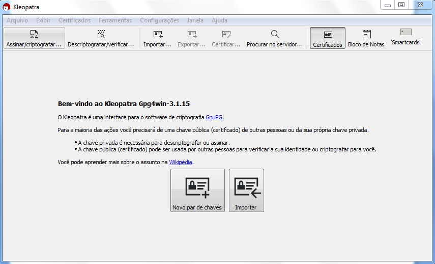
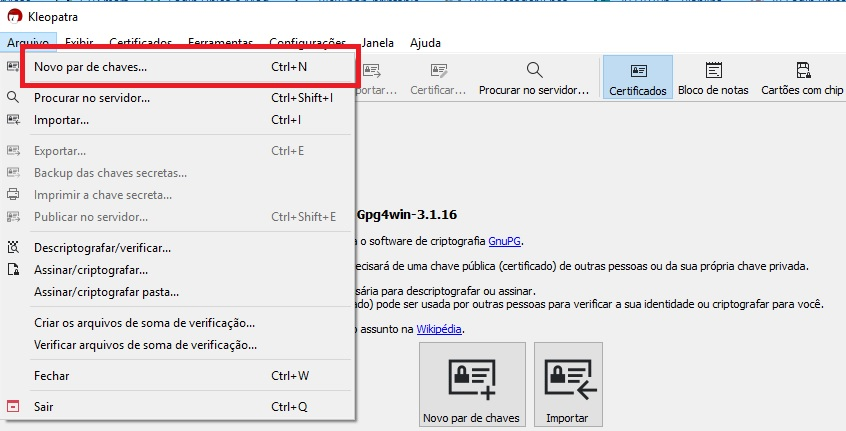
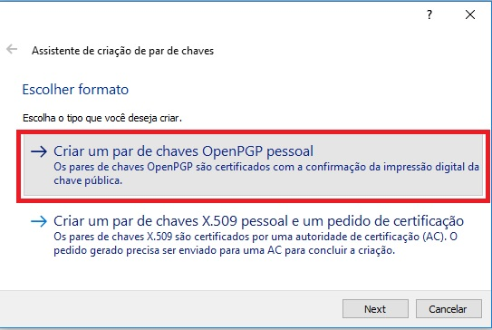
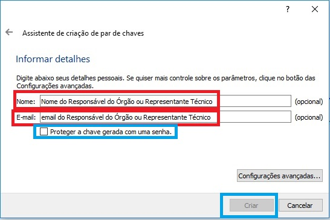
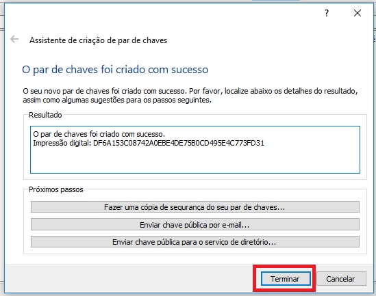
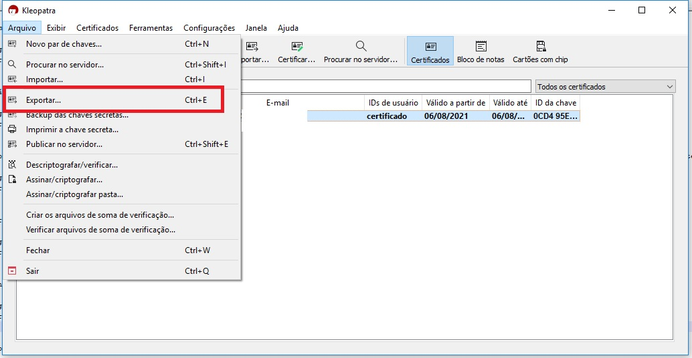
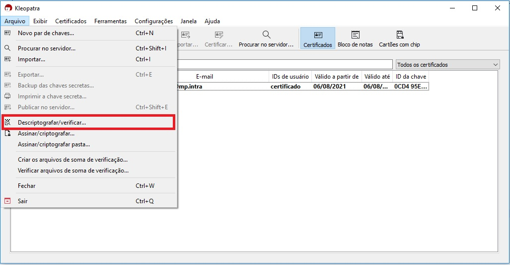
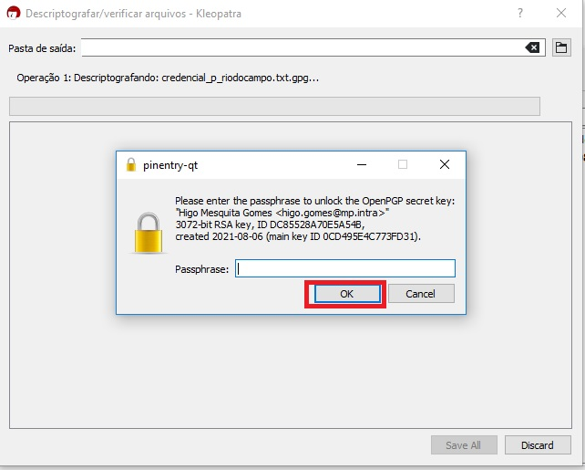
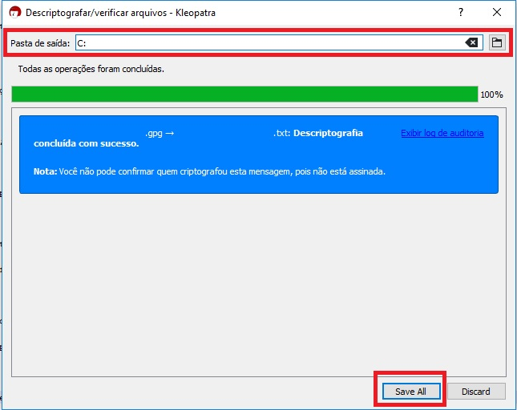

Administração das chaves PGP para credenciais do Login Único
============================================================

Como criar um par de chaves PGP
+++++++++++++++++++++++++++++++

O PGP (abreviação de Pretty Good Privacy, ou Muito Boa Privacidade) é um programa de criptografia de chave pública e privada altamente seguro e utilizado para proteção de conteúdo enviado por correio eletrônico.
 
Orientaremos como criar par de chaves PGP por meio do programa Gpg4win (versão windows), porém existem outras aplicativos permitem geração.

Sigam os passos para criação:

1. Realize download da versão mais recente do aplicativo `Gpg4win`_ ;
2. Siga os passos até finalizar instalação;
3. Execute o programa Kleopatra.

 
4. Selecione item do Menu **Arquivo / Novo Par de chaves**;

5. Selecione opção **Criar um par de chaves OpenPGP pessoal**;

6. Informe o **nome** e o **e-mail** do **Responsável Técnico** indicados no formulário de solicitação de integração, selecione a opção **"Proteger a chave com senha"** e clique no botão **"Criar"**. 

7. Concluída a criação clique no botão **Terminar**;

   
8. Selecione a chave criada, clique item do Menu **Arquivo / Exportar** para salvar chave pública;

9. Anexe a chave pública PGP no campo correspondente do formulário de solicitação de integração.

Como ler arquivo da credencial com chave PGP
++++++++++++++++++++++++++++++++++++++++++++

Orientaremos como ler arquivo por meio do programa Gpg4win (versão windows), porém existem outros aplicativos que podem ser empregados para esta finalidade.

Sigam os passos para criação:

1. Realize download da versão mais recente do aplicativo `Gpg4win`_ ;
2. Siga os passos até finalizar instalação;
3. Execute o programa Kleopatra.

4. Selecione item do Menu **Arquivo / Descriptografar/Verificar**;    

5. Selecione o arquivo com a credencial criptografada, digite a senha da geração do par de chaves, clique no botão **OK**;

   
6. Selecione a pasta deseja salvar o aquivo descriptografado e clique no botão **Save all**;

   
.. _`Gpg4win`: https://gpg4win.org/download.html  
   
