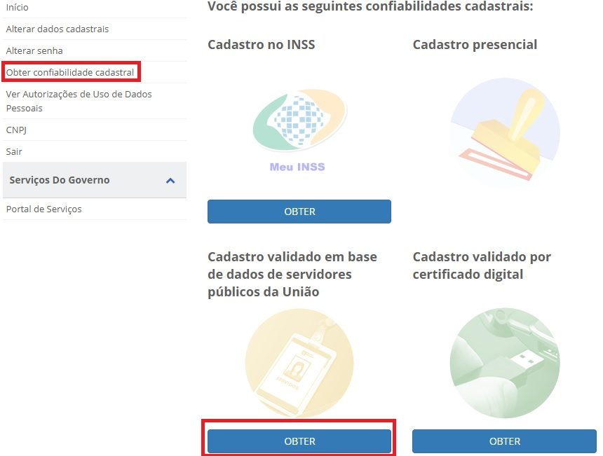
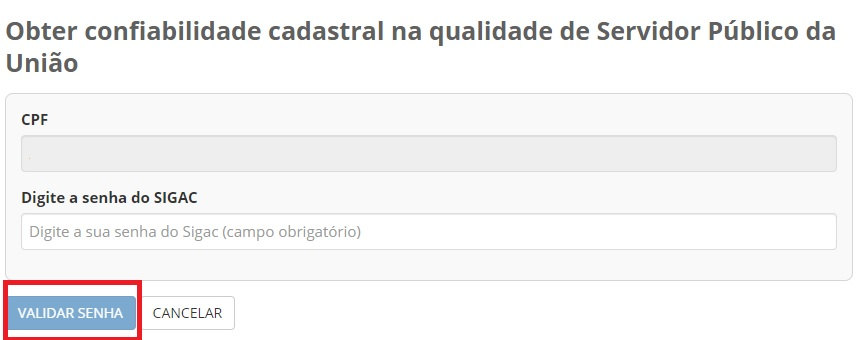

Como Atribuir o Selo Cadastro Básico com Validação em Base de Dados de Servidores Públicos da União
===================================================================================================

1- Cidadão acessa o Login Único. Digita o CPF e clica no botão **Próxima**. Digita a senha e clica no botão **Entrar**.

.. figure:: _images/tela_inicial_login_unico_entrar.jpg
    :align: center
    :alt:

2- Cidadão deve clicar no botão **Obter** abaixo do **Cadastro validado em base de dados de servidores públicos da União**. Tem se opção de acessar no menu **Obter Confiabilidade Cadastral** e clicar no botão **Obter** abaixo do **Cadastro validado em base de dados de servidores públicos da União**.  

3- Cidadão, servidor público da Únião, deve digitar senha cadastrada no Sistema de Gestão de Acesso `SIGAC/SIGEPE`_ |site externo|. Clica no botão **Validar Senha**

	
4- Cidadão adquire **Selo Cadastro Básico com Validação em Base de Dados de Servidores Públicos da União**. 

.. |site externo| image:: _images/site-ext.gif
.. _`LEI Nº 13.444, DE 11 DE MAIO DE 2017`: http://www.planalto.gov.br/ccivil_03/_ato2015-2018/2017/lei/l13444.htm
.. _`SIGAC/SIGEPE` : https://sso.gestaodeacesso.planejamento.gov.br/cassso/login