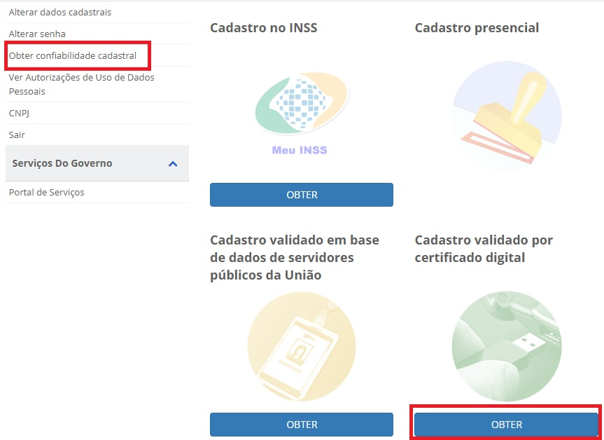
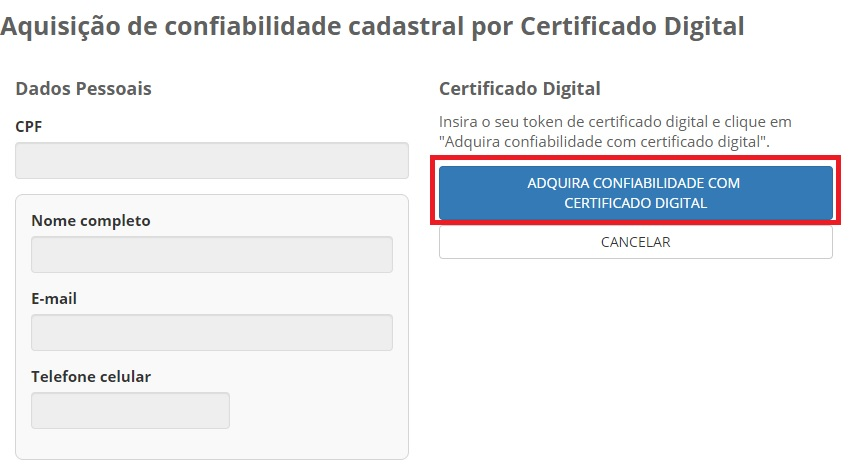

Como Atribuir o Selo Certificado Digital de Pessoa Física
=========================================================

1- Cidadão acessa o Login Único. Digita o CPF e clica no botão **Próxima**. Digita a senha e clica no botão **Entrar**.

.. figure:: _images/tela_inicial_login_unico_entrar.jpg
    :align: center
    :alt:

2- Cidadão deve clicar no botão **Obter** abaixo do **Cadastro validado por certificado digital**. Tem se opção de acessar no menu **Obter Confiabilidade Cadastral** e clicar no botão **Obter** abaixo do **Cadastro validado por certificado digital**.  

3- Cidadão aciona o Certificado Digital de Pessoa Fisíca ao computador (Tipo A1 - máquina - ou Tipo A3 - Token). Clica no botão **Adquirir Confiabilidade com Certificado Digital**

	
4- Cidadão adquire **Selo de Certificado Digital de Pessoa Física**. 

.. |site externo| image:: _images/site-ext.gif
.. _`LEI Nº 13.444, DE 11 DE MAIO DE 2017`: http://www.planalto.gov.br/ccivil_03/_ato2015-2018/2017/lei/l13444.htm
.. _`Meu INSS` : https://meu.inss.gov.br/
