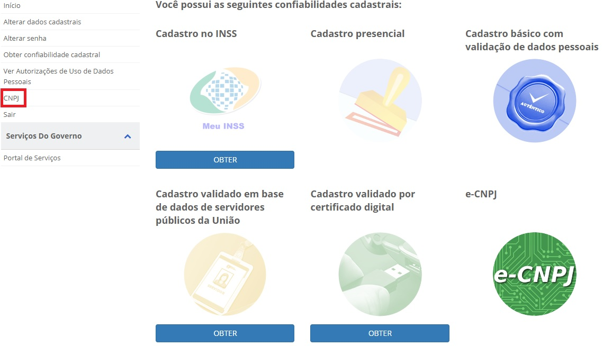
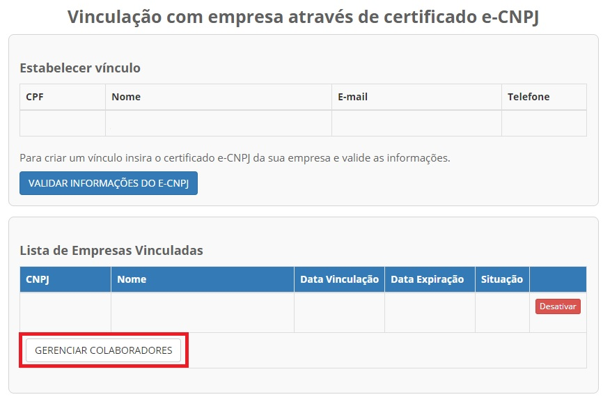
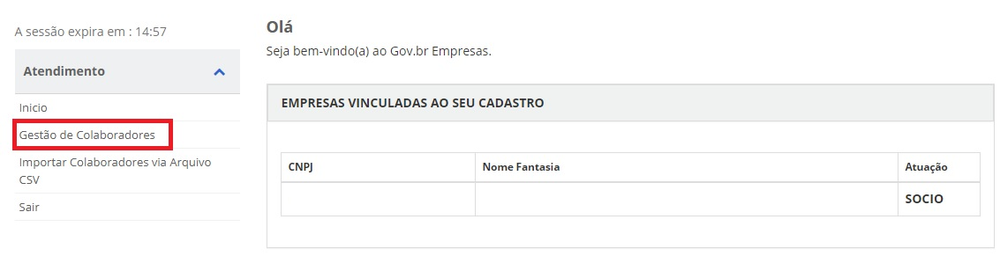
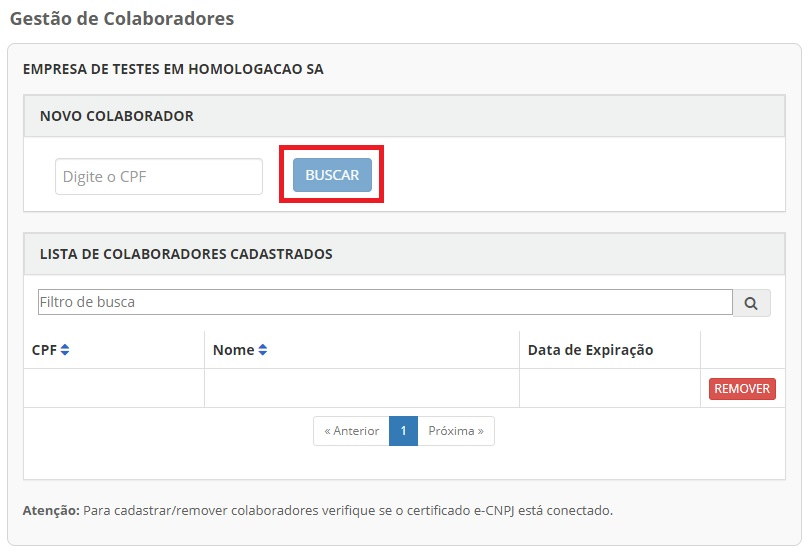
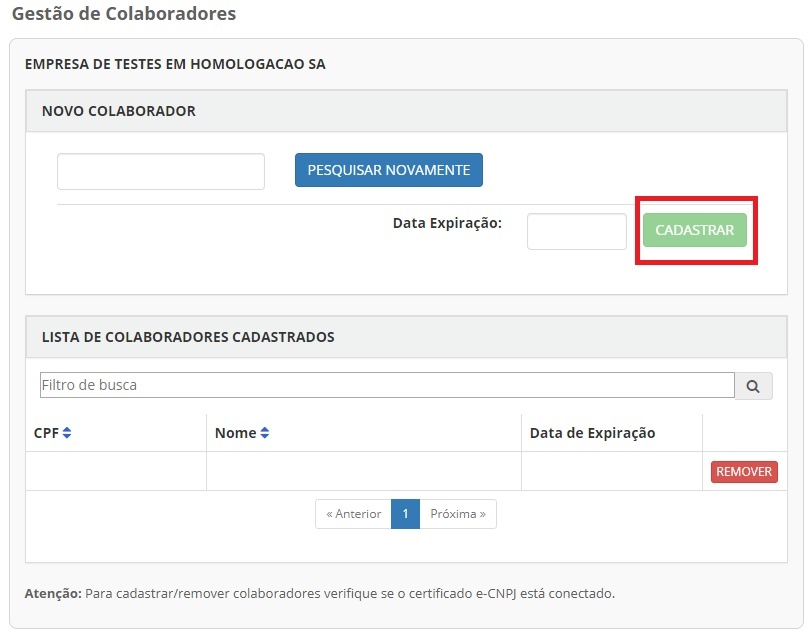

Como Atribuir o Selo Colaborador da Pessoa Jurídica
===================================================

1- Cidadão acessa o Login Único. Digita o CPF e clica no botão **Próxima**. Digita a senha e clica no botão **Entrar**.

.. figure:: _images/tela_inicial_login_unico_entrar.jpg
    :align: center
    :alt:

2- Cidadão deve acessar no menu **CNPJ**.  

3- Cidadão clica no botão **Gerenciar Colaboradores**

	
4- Cidadão deve acessar no menu **Gestão de Colaboradores**

5- Cidadão aciona o Certificado Digital de Pessoa Jurídica ao computador (Tipo A1 - máquina - ou Tipo A3 - Token) do representante do CNPJ. Digita o CPF que deseja vincular ao CNPJ (CPF deverá estar cadastrado no Login Único). Clica no botão **Buscar**

6- Cidadão digita data de expiração que CPF representará o CNPJ (data não pode ser superior data de validade do Certificado Digital de Pessoa Jurídica). Clica no botão **Cadastrar**

	
7- Cidadão adquire **Selo Colaborador da Pessoa Jurídica**. 
	
	
.. |site externo| image:: _images/site-ext.gif
.. _`LEI Nº 13.444, DE 11 DE MAIO DE 2017`: http://www.planalto.gov.br/ccivil_03/_ato2015-2018/2017/lei/l13444.htm
.. _`Meu INSS` : https://meu.inss.gov.br/
