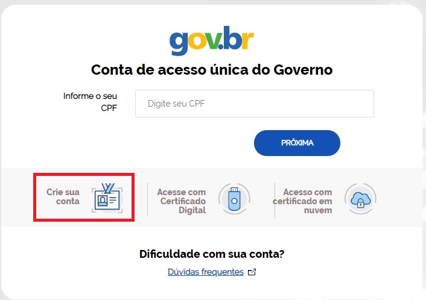
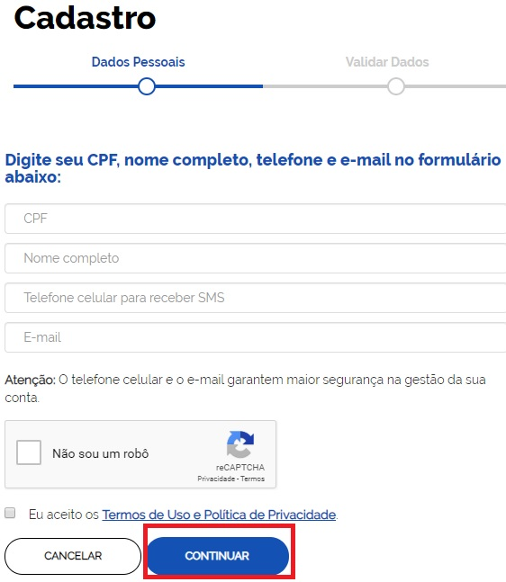
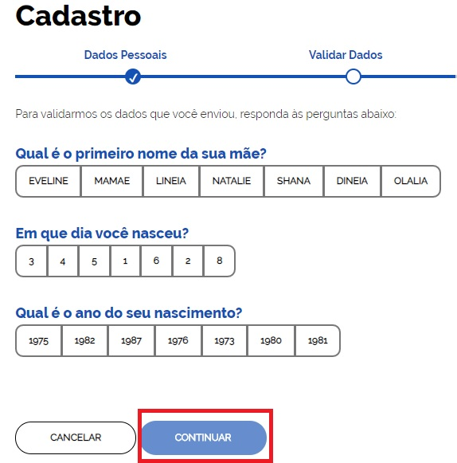
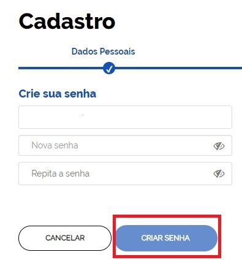
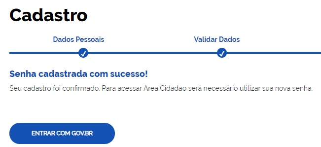

Como Atribuir o Selo Cadastro Básico com Validação de Dados Pessoais
====================================================================

1- Cidadão acessa o Login Único e seleciona parte **Criar Conta**;

2- Cidadão deve preencher as informações de **CPF**, **Nome**, **Email** e **Telefone**. Marca as opções **Eu não sou robô** e **Eu aceito os Termos de Uso e Política de Privacidade**. Clica no botão **Continuar**;

3- Cidadão deve responder as perguntas referente ao cadastro presente na Receita Federal / Ministério da Economia. Clica no botão **Continuar**

	
4- Cidadão seleciona opção deseja ativar conta **(email ou SMS)**. Clica no botão **Continuar**. 

Obs: **Caso cidadão selecione o email, será encaminhado um link para continuar o processo. Caso cidadão selecione SMS, será encaminhado, por mensagem de texto, um código numérico para continuar o processo.**

5- Cidadão digita e confirma senha nos campos **Nova Senha** e **Repita Senha**. Clica no botão **Criar Senha**.
	

6- Cadastro criado e o **Selo Cadastro Básico com Validação de Dados Pessoais** está presente na conta.

.. |site externo| image:: _images/site-ext.gif
.. _`LEI Nº 13.444, DE 11 DE MAIO DE 2017`: http://www.planalto.gov.br/ccivil_03/_ato2015-2018/2017/lei/l13444.htm
.. _`Meu INSS` : https://meu.inss.gov.br/
