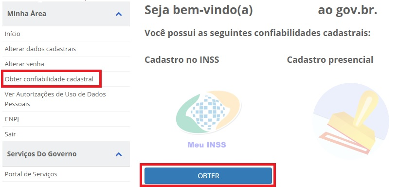
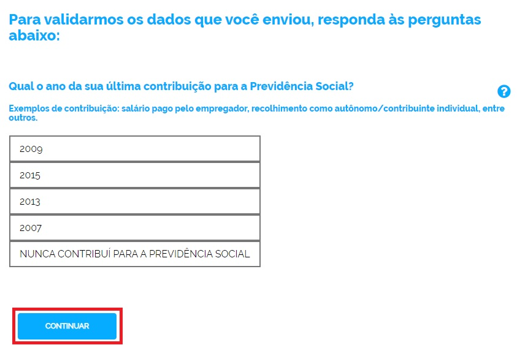

Como Atribuir o Selo Cadastro Básico com Validação de Dados Previdênciarios
===========================================================================

1- Cidadão acessa o Login Único. Digita o CPF e clica no botão **Próxima**. Digita a senha e clica no botão **Entrar**.

.. figure:: _images/tela_inicial_login_unico_entrar.jpg
    :align: center
    :alt: 

2- Cidadão deve clicar no botão **Obter** abaixo do **Selo Cadastro no INSS**. Tem se opção de acessar no menu **Obter Confiabilidade Cadastral** e clicar no botão **Obter** abaixo do **Selo Cadastro no INSS**.  

3- Cidadão deve responder todas perguntas referente ao cadastro presente no INSS / Ministério da Economia. Clica no botão **Continuar** para cada pergunta até finalizar.

	
4- Cidadão adquire **Selo Cadastro no INSS**. 

.. |site externo| image:: _images/site-ext.gif
.. _`LEI Nº 13.444, DE 11 DE MAIO DE 2017`: http://www.planalto.gov.br/ccivil_03/_ato2015-2018/2017/lei/l13444.htm
.. _`Meu INSS` : https://meu.inss.gov.br/
