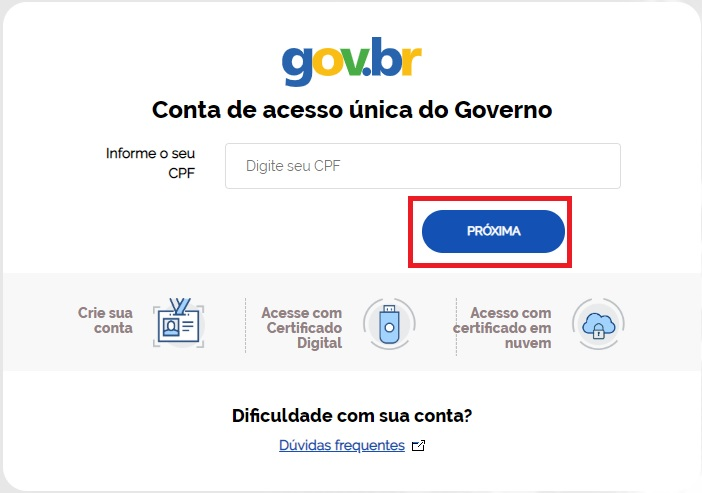
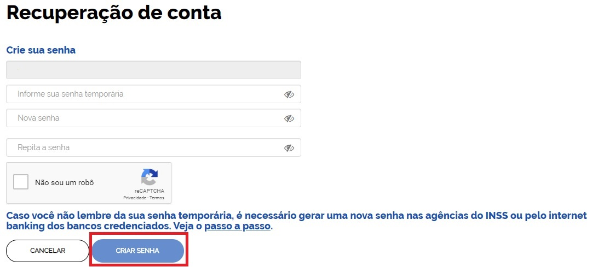

Como Atribuir o Selo Internet Banking
=====================================

1- Cidadão deve acessar a conta bancária por meio do Internet Banking (versão WEB) para criar senha temporária. O cidadão deverá verificar quais os `Bancos Permitidos e Passos para Cada Banco para Gerar Senha Temporária`_.     

2- Cidadão criará senha temporária por meio do acesso ao Internet Banking

3- Cidadão acessa o Login Único. Digita o CPF e clica no botão **Próxima**

	
4- Cidadão digita **senha temporária**, **nova senha**, **repete nova senha**. Clica no botão **Criar Senha**

5- Cidadão adquire **Selo Internet Banking**. A identificação no Login Único é **Selo Cadastro no INSS**. 	

.. |site externo| image:: _images/site-ext.gif
.. _`LEI Nº 13.444, DE 11 DE MAIO DE 2017`: http://www.planalto.gov.br/ccivil_03/_ato2015-2018/2017/lei/l13444.htm
.. _`Meu INSS` : https://meu.inss.gov.br/
.. _`Bancos Permitidos e Passos para Cada Banco para Gerar Senha Temporária`: http://faq-login-unico.servicos.gov.br/en/latest/_perguntasdafaq/naotenhoacessoaaminhasenhatemporaria.html
