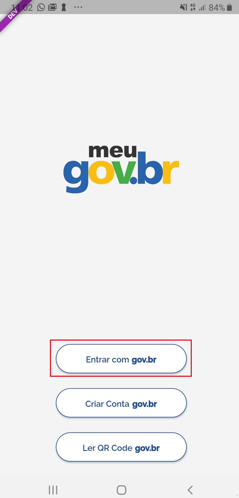
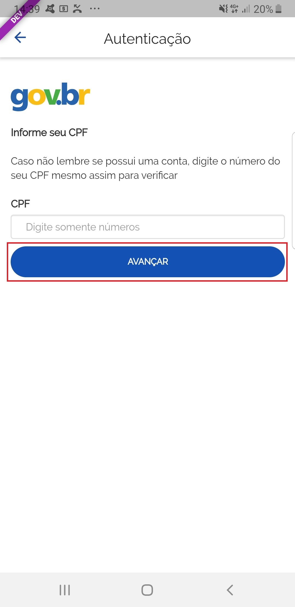
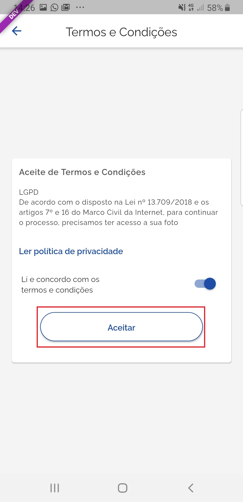
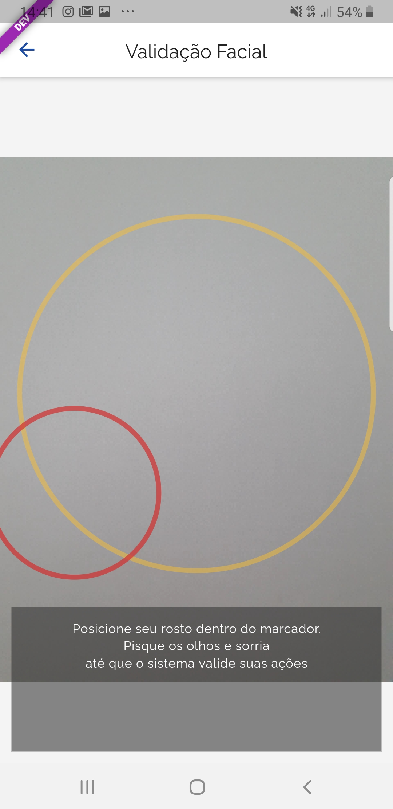
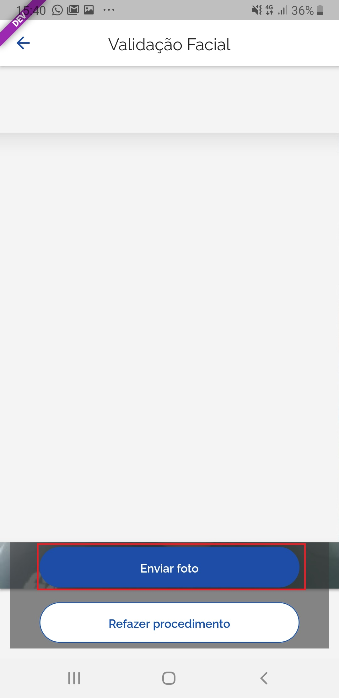
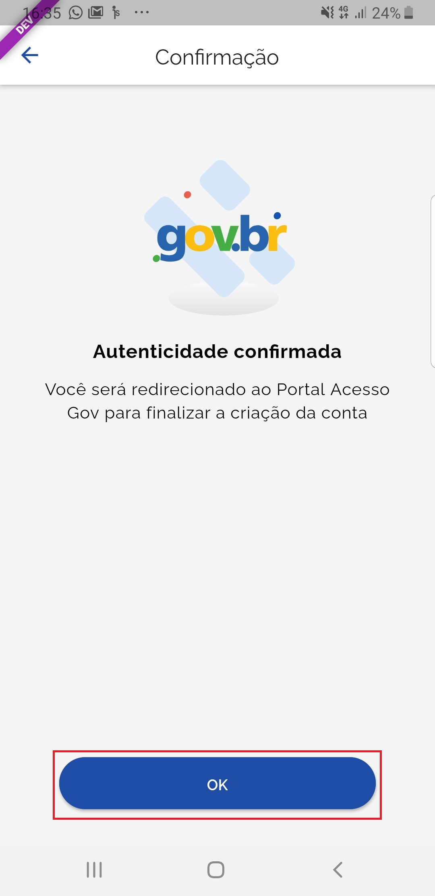
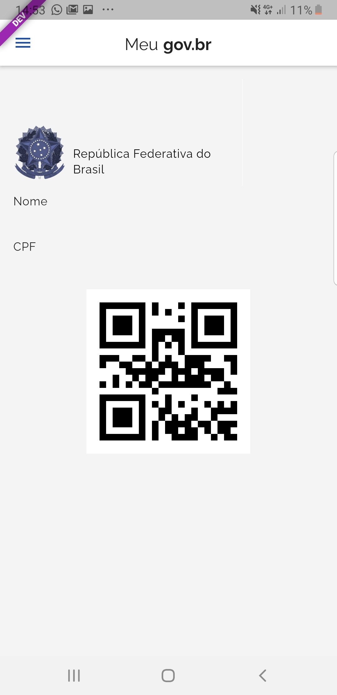

Como Atribuir o Selo Validação Facial
=====================================

1. Baixe e instale o aplicativo Meu gov.br. `Orientações para baixar o aplicativo Meu GOV.BR`_.

2. Acesse o aplicativo Meu GOV.BR no celular:

3. Clique no botão **Entrar com gov.br**

4. Digite CPF e clique no botão **Avançar**

5. Marque **Li e concorco com os termos e condições** e clique no botão **Aceitar**.

6. Posicionar o rosto de frente para câmera frontal do celular seguindo as orientações de piscar os olhos e sorrir até sistema validar as informações. Após, aguarde o aplicativo tirar foto.
   

7. Clique no botão **Enviar Foto**  

8. Clique no botão **OK**

9. Cidadão adquire **Selo Validação Facial**

   

.. |site externo| image:: _images/site-ext.gif
.. _`Orientações para baixar o aplicativo Meu GOV.BR` : http://faq-login-unico.servicos.gov.br/en/latest/_perguntasdafaq/oqueemeugovbrmobile.html