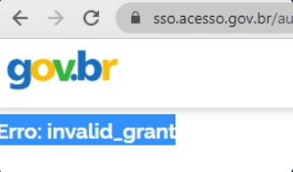

Erros Comuns para Implementação do Login Único
==============================================

INVALID_GRANT
+++++++++++++

A imagem acima mostra o erro que ocorre pela ausência do cadastro da URL de retorno na credencial do Login Único.

Os procedimentos para resolução:

1. Checar com os responsáveis pela solitação da credencial se a URL estava no pedido
2. Caso conste no pedido, enviar a chamada do /Authorize completa fora de imagem para realizar a analise e possível adição da URL a credencial

.. |site externo| image:: _images/site-ext.gif
.. _`codificador para Base64`: https://www.base64decode.org/
.. _`Plano de Integração`: arquivos/Modelo_PlanodeIntegracao_LOGINUNICO_Versao-4.doc
.. _`OpenID Connect`: https://openid.net/specs/openid-connect-core-1_0.html#TokenResponse
.. _`auth 2.0 Redirection Endpoint`: https://tools.ietf.org/html/rfc6749#section-3.1.2
.. _`Exemplos de Integração`: exemplointegracao.html
.. _`Design System de Governo`: https://webcomponent-ds.estaleiro.serpro.gov.br/?path=/story/componentes-signin--tipo-externo-com-texto
.. _`Resultado Esperado do Acesso ao Serviço de Confiabilidade Cadastral (Selos)`: iniciarintegracao.html#resultado-esperado-do-acesso-ao-servico-de-confiabilidade-cadastral-selos
.. _`Resultado Esperado do Acesso ao Serviço de Confiabilidade Cadastral (Categorias)` : iniciarintegracao.html#resultado-esperado-do-acesso-ao-servico-de-confiabilidade-cadastral-categorias
.. _`Documento verificar Código de Compensação dos Bancos` : arquivos/TabelaBacen.pdf
.. _`administrar as chaves PGP para credenciais do Login Único`: chavepgp.html
.. _`RFC PKCE`: https://datatracker.ietf.org/doc/html/rfc7636
.. _`Passo 3`: iniciarintegracao.html#passo-3
.. _`Ajuda para geração do code_challenge`: https://tonyxu-io.github.io/pkce-generator/