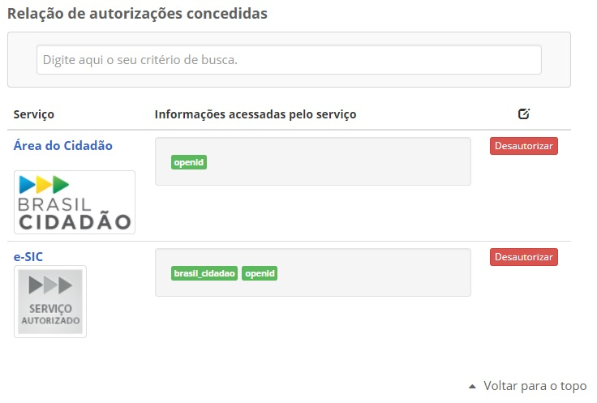

Escopos de Atributos
====================

São conjuntos de informações fornecidos a quem possui autorização.

A figura 5 apresenta tela dos escopos por serviços:

Atributos Disponíveis
+++++++++++++++++++++

Existem dois escopos disponibilizados pelo Brasil Cidadão para apresentar os atributos disponíveis:

- brasil_cidadao (CPF, Nome, e-mail, telefone, foto);
- brasil_cidadao_empresa (CNPJ, Nome Fantasia, CPF do Responsável, Nome do Responsável, Atuação no CNPJ).
   
.. |site externo| image:: _images/site-ext.gif
            