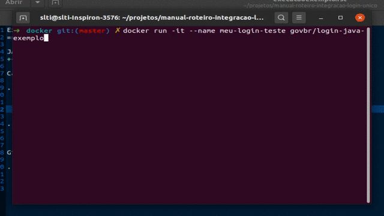

Execução do Exemplo de Integração
=================================

JAVA
++++

Caso você queira ver o exemplo JAVA funcionando execute com o Docker instalado:

.. code-block:: console

    $ docker run -it \
      --name meu-login-teste govbr/login-java-exemplo

.. warning::
    Siga os passos que vão aparecer no terminal.

Gif mostrando como executa o exemplo:

   Exemplo com o comando docker em JAVA.
