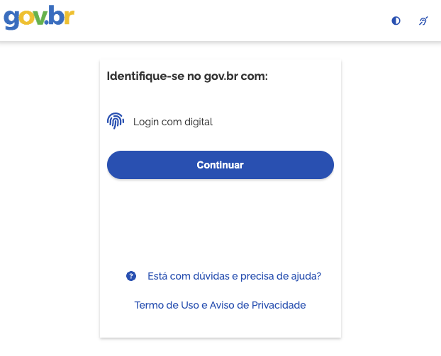
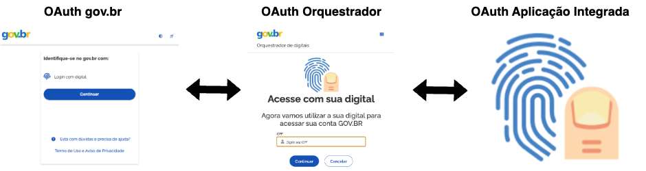

Integração com Totens
=====================

**Roteiro de Integração de Aplicação com Leitura de Impressão Digital com Orquestrador de Digitais do gov.br**

Contexto de integração com o gov.br
-----------------------------------

A aplicação que se integrar com o orquestrador de digitais do gov.br será executada em um terminal de autoatendimento físico que será chamado daqui em diante por **'totem'**.

No totem haverá um site cliente do gov.br. Nessa integração o gov.br disponibilizará a opção de se autenticar nesse site por meio de impressão digital.

A pessoa ao selecionar a opção de **Login com digital** será redirecionada para o orquestrador de digitais do gov.br em que a mesma fornecerá o seu CPF.

.. image:: _images/cpf.png
   :height: 300px
   :align: center

O gov.br valida o CPF e redireciona para a aplicação integrada ao orquestrador. A aplicação realiza a leitura física da impressão digital da pessoa.

Uma vez concluída a leitura, a pessoa é redirecionada de volta para o orquestrador e em seguida é autenticada no site pelo gov.br.

Pessoas autenticadas por meio de impressão digital ganham confiabilidade de nível ouro no gov.br.

Aplicação integrada
-------------------

A aplicação que deseja se integrar com o orquestrador de digitais do gov.br precisa necessariamente implementar o fluxo *Authorization Code Flow* padrão do protocolo **OAuth 2.0** (`RFC 6749`_).

.. _RFC 6749: https://datatracker.ietf.org/doc/html/rfc6749

Arquitetura da solução
----------------------

A arquitetura da solução é composta por três provedores OAuth 2.0 envolvidos: o próprio **gov.br**, o **orquestrador de digitais do gov.br** e a **aplicação integrada**. Esta se integrará com o orquestrador e implementará a leitura física da digital do cidadão.

Um pouco sobre OAuth 2.0
~~~~~~~~~~~~~~~~~~~~~~~~

A aplicação integrada será o provedor (*authorization server*) e o orquestrador de digitais do gov.br será uma aplicação cliente desse provedor.

O fluxo de autorização (*Authorization Code Flow*) consiste resumidamente em dois passos:

1. Authorization Endpoint
~~~~~~~~~~~~~~~~~~~~~~~~~

O orquestrador de digitais será o cliente da aplicação integrada. O orquestrador fará a requisição de autorização (*Authorization Endpoint*). Essa requisição é basicamente um redirecionamento do browser (HTTP 302) para o endpoint de autorização do provedor.

Exemplo de chamada à URI de autorização:

::

   302
   https://www.aplicacao-integrada.gov.br/authorize?response_type=code&scope=openid&redirect_uri=https://biometria.validacao.acesso.gov.br/enter-account-id-redirection-endpoint/{PROVEDOR}&client_id=orquestrador-gov-br&state=MEU_STATE

Neste momento o usuário será redirecionado para a aplicação integrada, onde esta realizará o procedimento de leitura física da impressão digital.

Uma vez que o processo de leitura seja concluído, o provedor retornará para a URI de redirecionamento do orquestrador de digitais com o parâmetro *state*. Em caso de sucesso retornará também um parâmetro *code*, ou *error* caso tenha ocorrido algum erro.

Em caso de sucesso, o orquestrador realizará posteriormente uma chamada ao *Token Endpoint* no backend.

2. Token Endpoint
~~~~~~~~~~~~~~~~~

Com o parâmetro **code** recebido, o orquestrador de digitais irá realizar uma chamada para o **Token Endpoint** definido pela aplicação integrada.

Exemplo:

::

   POST
   https://www.aplicacao-integrada.gov.br/token

   Headers:
   Authorization: Basic base64(client_id:secret)
   Content-Type: form-url-encoded

   grant_type=code
   client_id=orquestrador-gov-br
   redirect_uri=https://biometria.validacao.acesso.gov.br/enter-account-id-redirection-endpoint/{PROVEDOR}
   code=CODE_RECEBIDO

A aplicação integrada pode disponibilizar a impressão digital lida por meio do *User Info Endpoint*. O resultado deve ser disponibilizado em formato JSON (`RFC 8259`_) contendo a impressão digital em formato WSQ.

.. _RFC 8259: https://datatracker.ietf.org/doc/html/rfc8259

Formato sugerido:

::

   {
       "polegar_direito": "POLEGAR_DIREITO_EM_WSQ"
   }

Uma vez validada a digital, o orquestrador retorna para que o usuário seja autenticado no gov.br.

Primeiros passos
----------------

Contato
~~~~~~~

Para realizar a integração com o orquestrador de digitais é necessário entrar em contato através do e-mail:

``integracaoid@economia.gov.br``

Cadastro do Orquestrador na aplicação integrada
~~~~~~~~~~~~~~~~~~~~~~~~~~~~~~~~~~~~~~~~~~~~~~~

A aplicação integrada precisa fornecer as **credenciais** para os ambientes disponíveis. É necessário fornecer um *Client ID* e uma *Secret* para que sejam utilizados pelo orquestrador. Também é necessário cadastrar as **URIs de retorno**.

============ ========================================================================
**Ambiente** **URI de Retorno**                                                           
------------ ------------------------------------------------------------------------
Staging      https://digitais.staging.acesso.gov.br/redirection-endpoint/{PROVEDOR}  

Produção     https://digitais.acesso.gov.br/redirection-endpoint/{PROVEDOR}           
============ ========================================================================

Recuperação de conta
--------------------

O gov.br também disponibiliza um fluxo de recuperação de conta que pode ser realizado nos terminais de autoatendimento.

A aplicação integrada pode manter as mesmas credenciais, sendo necessário apenas cadastrar as URIs abaixo:

============= ================================================================================= =====================================
**Ambiente**   **URIs de Retorno**                                                                                         
------------- --------------------------------------------------------------------------------- -------------------------------------
Staging       https://biometria.staging.acesso.gov.br/enter-account-id-redirection-endpoint/{P} https://biometria.staging.acesso.gov.br/confirm-new-contact-redirection-endpoint/{P}      
Produção      https://biometria.acesso.gov.br/enter-account-id-redirection-endpoint/{P}         https://biometria.acesso.gov.br/confirm-new-contact-redirection-endpoint/{P}
============= ================================================================================= =====================================

Dúvidas?
--------

Entre em contato conosco através do e-mail:

``integracaoid@economia.gov.br``
