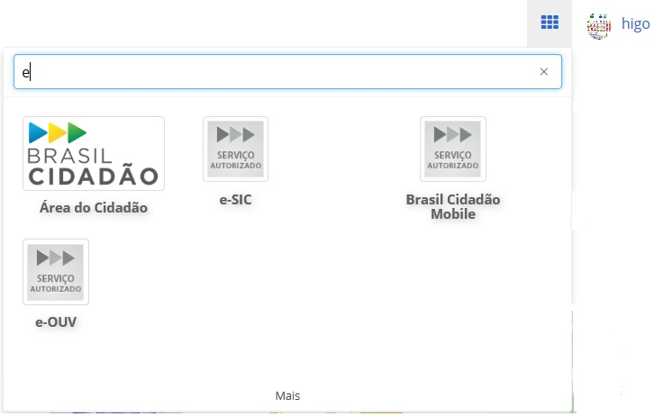

Lançador de Serviços
====================

O Login Único/GOV.BR (Brasil Cidadão) apresenta o conceito de *Single Sign On* na arquitetura: um ponto único de autenticação, que permite ao usuário fazer o login e acessar diversos serviços ou sistemas integrados. Para permitir isto de forma explicita, o Login Único/GOV.BR (Brasil Cidadão) apresenta um funcionalidade chamada Lançador de Serviços.

Esta funcionalidade lista todos os serviços ou sistemas integrados autorizados uma vez pelo cidadão. A figura abaixo demonstra o Lançador de Serviços ativo e as configurações são entregues pelos serviços integrados ao Login Único/GOV.BR (Brasil Cidadão).

.. |site externo| image:: _images/site-ext.gif
            