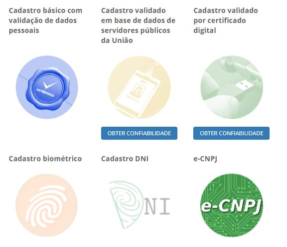

Selos de Confiabilidade Cadastral
=================================

Consistem em compor níveis de segurança das contas com a obtenção dos atributos autoritativos do cidadão a partir das bases oficias de governo, por meio das quais permitirão a utilização da credencial de acesso em sistemas internos dos clientes e serviços providos diretamente ao cidadão.

Uso possível para o selo é o uso do nível de confiança cadastral pelos serviços para aplicar controle de acesso às funcionalidades mais críticas. Na figura 6, demonstra os selos de confiabilidade cadastral na área cidadão do Login Único/GOV.BR (Brasil Cidadão):

.. |site externo| image:: _images/site-ext.gif
            