Solicitar Credencial do Login Único
===================================

As credencias para acesso ao ambiente de teste e produção do Login Único serão solicitadas por meio de sistema específico tendo as etapas:

- **Permissão para Login Único**
- **Credencial de Teste para Login Único**
- **Aprovação da Integração para Utilizar Login Único**
- **Credencial de Produção para Login Único**

Permissão para Login Único
+++++++++++++++++++++++++++++++++++

1. Acessar o link para `Solicitar Integração aos Produtos de Identidade Digital gov.br`_  

2. Clique no botão **Iniciar**.

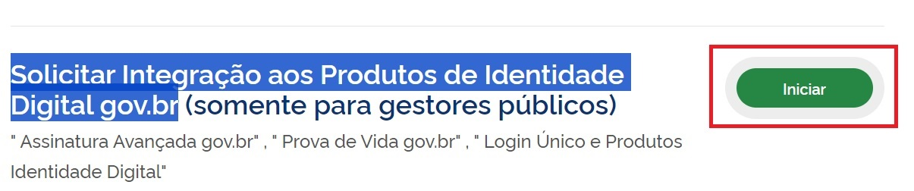

3. Entre com a Conta gov.br.   

4. Preencha as informações obrigatórias do cadastro

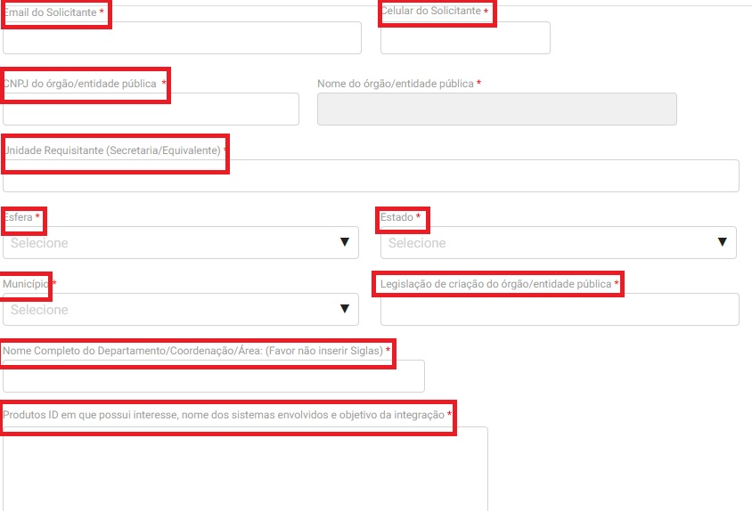
	
5. Preenchar as informações do serviço e clicar no botão **Adicionar Dados na Tabela**

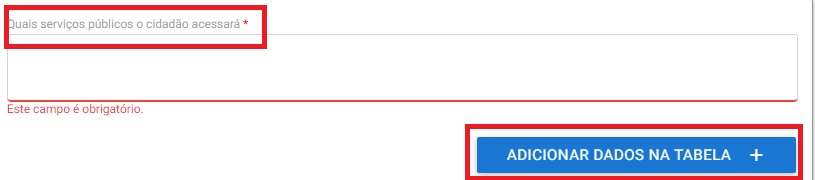
 

6. Clicar no botão **Submeter**

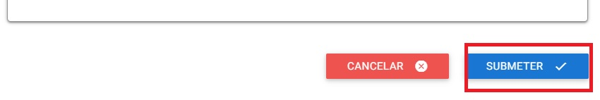

7. Aguardar a aprovação. **O tempo estimado é de até 72h**

Credencial de Teste para Login Único
+++++++++++++++++++++++++++++++++++++++++

1. Verifique a aprovação de solicitação de permissão para Login Únicono email informado no pedido

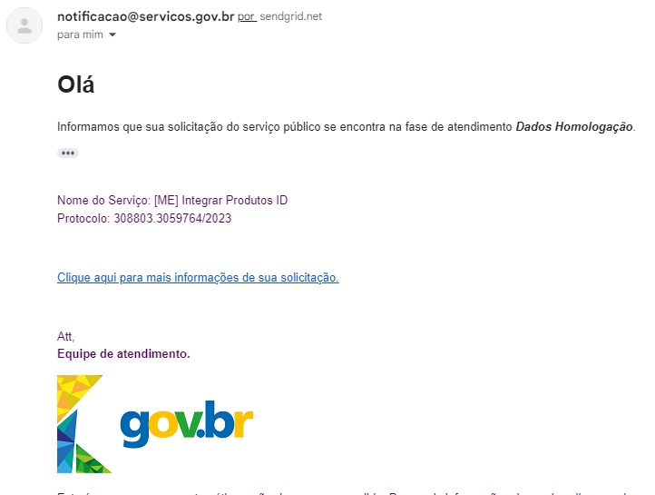

2. Acessar o link para `Sistema de acompanhamento de solicitações de credencial do Login Único`_  

3. Procure o protocolo da solicitação aprovada e clique no botão **Responder**

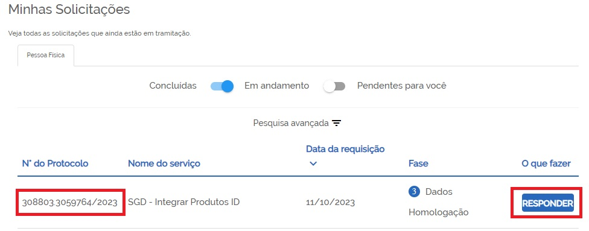

4. Preencha as informações obrigatórias dos Dados Funcionais do Requisitante

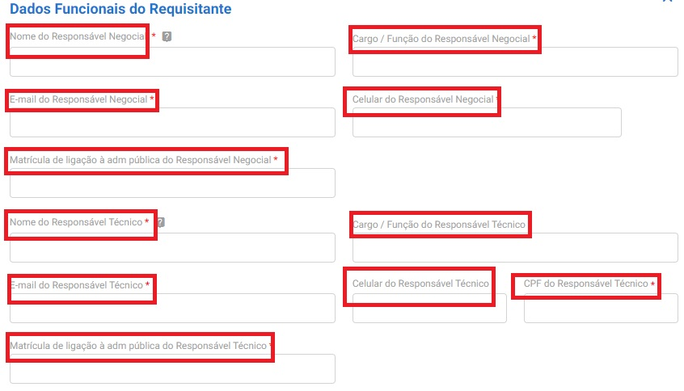
	
5. Selecione o produto **Autenticação Login Único** 

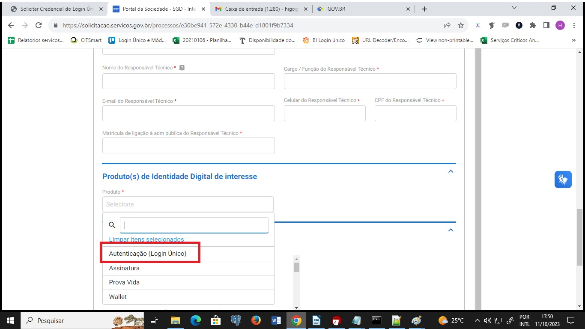
 

6. Preencha as informações técnicas obrigatórias e clique no botão **Adicionar Dados na Tabela**

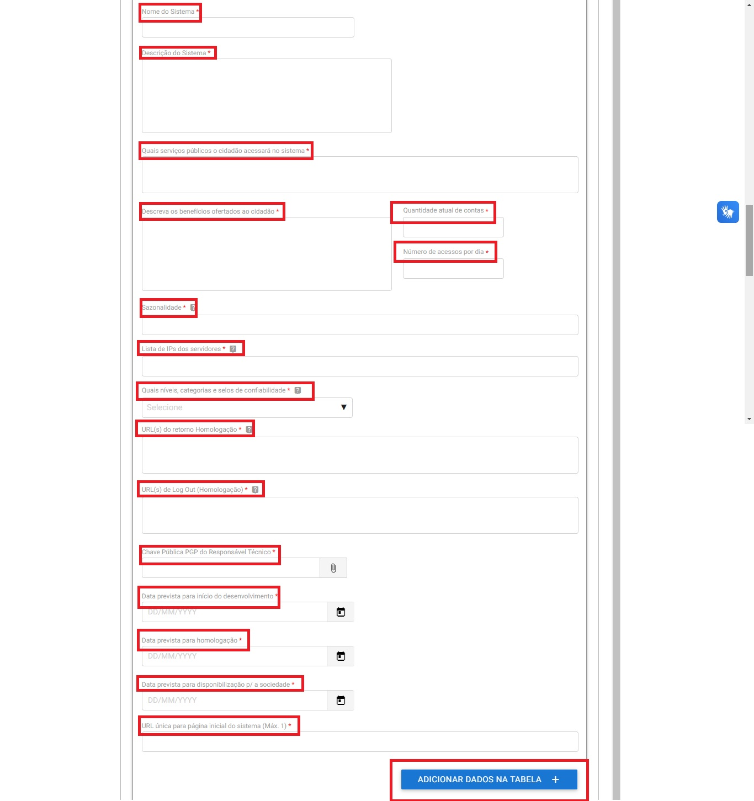

7. Clicar no botão **Submeter**

8. Clicar no botão destacado para baixar o documento com intuito de assinar. Para assinatura do documento, utilizar o `assinador.iti.br`_

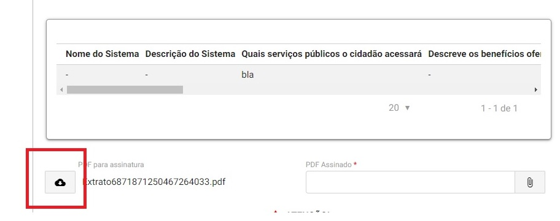
	
9. Realizar o Upload do documento assinado. Clicar no botão **Enviar**

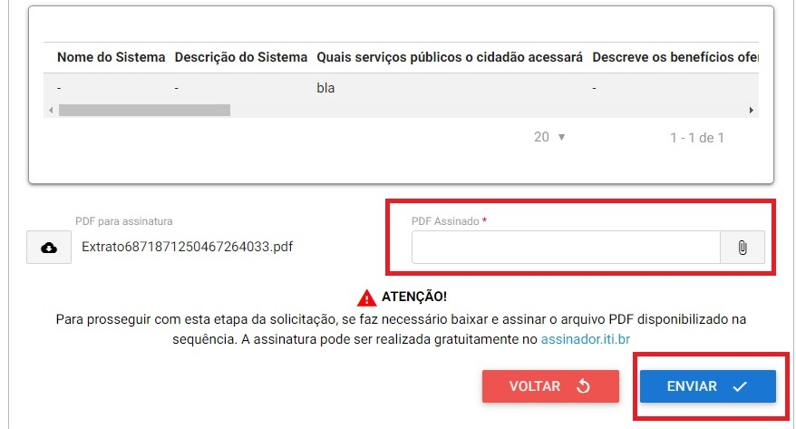

10. A credencial será enviada ao email do requisitante técnico informado no documento assinado. **O tempo estimado é de até 72h**

Aprovação da Integração para Utilizar Login Único
+++++++++++++++++++++++++++++++++++++++++++++++++++++++++++

1. Grave um vídeo comprovando a integração. Deverá contemplar desde o botão de acesso até a entrada no sistema.

2. Acessar o link para `Sistema de acompanhamento de solicitações de credencial do Login Único`_  

3. Procure o protocolo da solicitação aprovada e clique no botão **Responder**

	
4. Realizar o Upload do vídeo comprovando a integração. Clicar no botão **Desenvolvimento Concluído** 

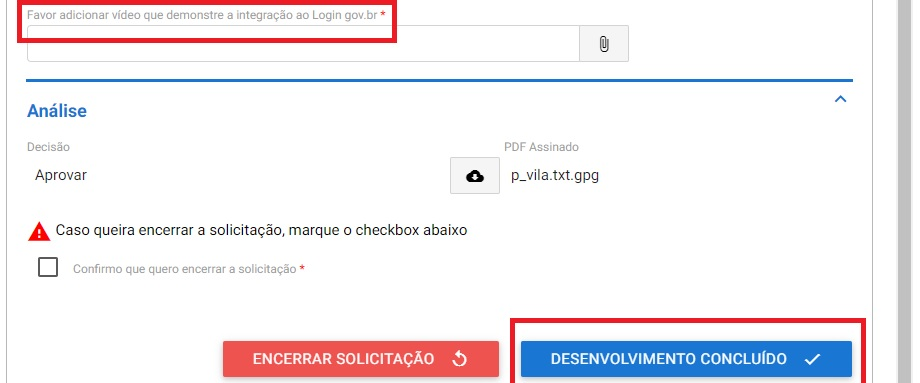
 

5. Aguardar a aprovação a ser enviada ao email. **O tempo estimado é de até 72h**

Credencial de Produção para Login Único
+++++++++++++++++++++++++++++++++++++++

1. Verifique a aprovação da integração para Login Único no email informado no pedido

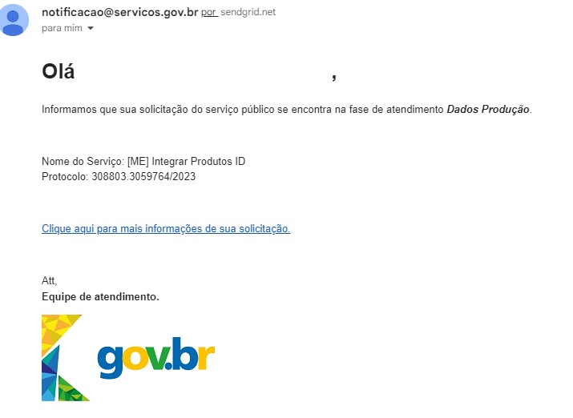

2. Acessar o link para `Sistema de acompanhamento de solicitações de credencial do Login Único`_  

3. Procure o protocolo da solicitação aprovada e clique no botão **Responder**

4. Clicar no botão com símbolo de caneta para iniciar o preenchimento das informações.

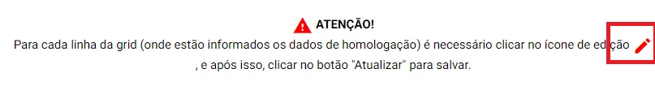

5. Preencha as informações obrigatórias para credencial de produção. Clicar no botão **Atualizar**

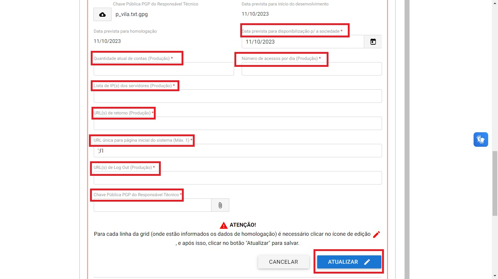
	

6. Clicar no botão **Enviar**

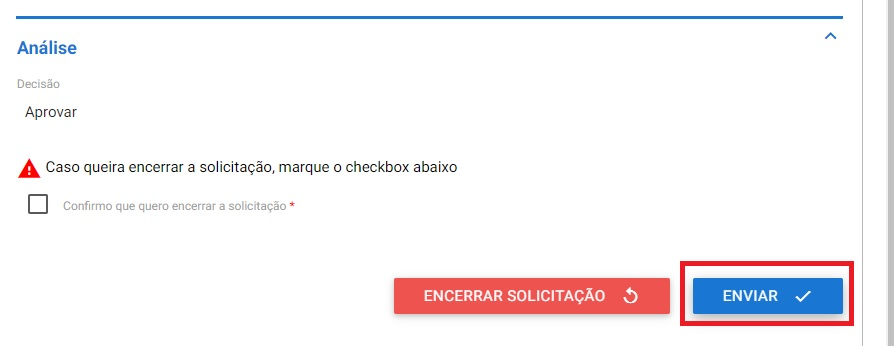

7. A credencial será enviada ao email do requisitante técnico informado no documento assinado. **O tempo estimado é de até 72h**

.. |site externo| image:: _images/site-ext.gif
.. _`Solicitar Integração aos Produtos de Identidade Digital gov.br`: https://www.gov.br/pt-br/servicos/solicitar-integracao-aos-produtos-de-identidade-digital-gov-br-somente-para-gestores-publicos
.. _`Sistema de acompanhamento de solicitações de credencial do Login Único` : https://solicitacao.servicos.gov.br/ 
.. _`assinador.iti.br` : https://assinador.iti.br           